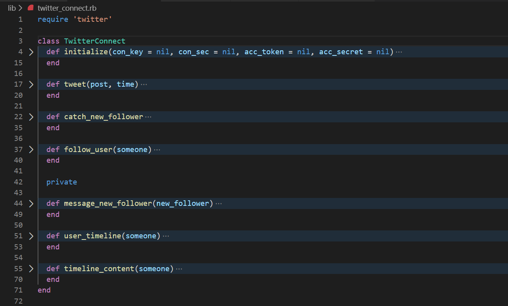

# Ruby Capstone project on Twitter Bot

> In this project, I have developed Twitter Bot using Ruby which connects to Twitter API.

Capstone projects are solo projects at the end of the each of the Microverse Main Technical Curriculum sections. It is a real-world-like project built with business specification. This project has Bot functionality which interacts with Twitter API to follow new user, check their tweets, see if someone has started following you. Hence, send welcome message to them.
Apart from above task, it will also give you latest Job, Covid cases and Indian Festivals updates.

## Built With

- Ruby
- VScode
- Twitter API
- Rspec

## Code Presentation

[Project Demo](https://www.loom.com/share/f14874c94b594de4bf486794f28da703)

## Getting Started

<strong>Request access to Twitter API</strong>

In order to test the Twitter Bot, you will need to apply for a Developer access on your account. Upon confirmation, create an APP on Twitter Developer portal and save token it generates. Also, ensure you have permission to this API with read, write and DM. 

### Prerequisites

In order to test the bot, you do need to have Ruby (at least 2.5) and Rspec installed.

### Install

<strong>Follow steps below to setup your environment</strong>

$ git clone https://github.com/rajkumardas2701/Ruby-Capstone.git \n
$ bundle install -> run this command to install the required gems \n
$ bin/main.rb -> run this command to run the program \n
$ gem install rspec -> run this command to install rspec \n
$ rspec ->run this command to test the program with rspec \n

### Usage

<strong>Things this Bot can do,</strong>

1. It will help you follow someone
2. It will get Timeline of same user
3. It will check if you have new follower. if yes, it will send welcome DM
4. It will post Corona status in India as per <a href="https://www.mygov.in/covid-19/#">website</a>
5. It will post Indian Festivals on specific dates as per <a href="https://www.drikpanchang.com/calendars/indian/indiancalendar.html">website</a>
6. It will post Job updates as per <a href="https://www.freshersworld.com/jobs-in-bangalore/9999016065">website</a>

## Authors

👤 **Rajkumar Das**

- Github: [@rajkumardas2701](https://github.com/rajkumardas2701)
- Twitter: [@Rajkuma58621299](https://twitter.com/Rajkuma58621299)
- Linkedin: [Rajkumar Das](https://www.linkedin.com/in/rajkumar-das-41308961/)

## 🤝 Contributing

Contributions, issues and feature requests are welcome!

Feel free to check the [issues page](https://github.com/rajkumardas2701/Ruby-Capstone/issues).

## Show your support

Give a ⭐️ if you like this project!

## Acknowledgments

- Thanks to @expjazz for sharing learning articles.

## 📝 License

This project is [MIT](lic.url) licensed.
